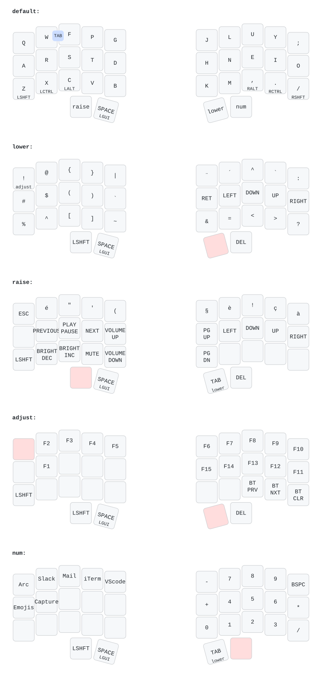

# ZMK Urchin keymap

Done with https://github.com/caksoylar/keymap-drawer

## Dongle LED indicator

The Xiao BLE dongle uses [zmk-rgbled-widget](https://github.com/caksoylar/zmk-rgbled-widget) to show the active layer:

| Layer  | Color  |
| ------ | ------ |
| base   | off    |
| lower  | red    |
| raise  | green  |
| adjust | yellow |
| num    | blue   |
